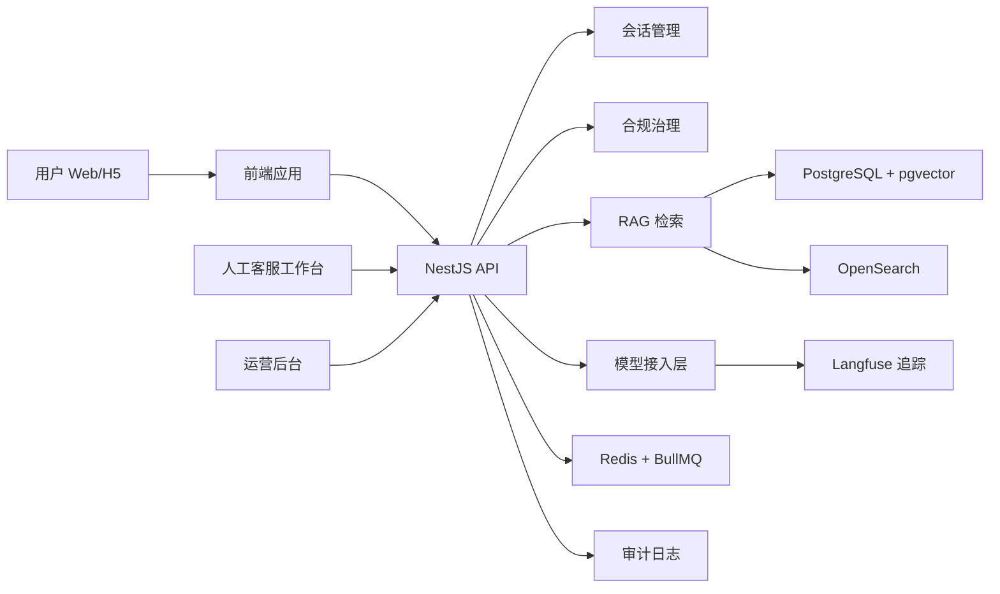

# 架构概览

## 数据流

1. 用户通过 Web Chat 或移动 H5 进入会话。
2. 前端调用会话 API 创建或恢复会话。
3. 用户消息先进入合规筛查。
4. 普通问题进入 RAG 检索，组合关键词、向量和重排序结果。
5. 模型接入层基于 Prompt、知识来源和安全边界生成回答。
6. 回答、引用来源、模型调用、满意度和人工转接记录进入审计链路。
7. 高风险、低置信度、投诉举报和敏感问题转人工。

## 部署形态

- 内网私有化部署
- 政务云部署
- 企业 Kubernetes 集群部署
- 数据库、Redis、OpenSearch、Langfuse 均支持私有化
